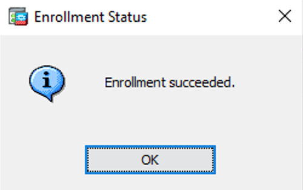

.. SafeNet Trusted Access documentation master file, created by
   sphinx-quickstart on Wed Mar 24 16:12:19 2021.
   You can adapt this file completely to your liking, but it should at least
   contain the root `toctree` directive.

========================================================================================
Cisco ASA SSL VPN and Cisco AnyConnect Client with SafeNet Trusted Access using SAML 2.0
========================================================================================

.. toctree::
   :maxdepth: 3
   :hidden:

   index

Overview
========

This guide shows how to implement adaptive authentication with strong contextual security policies to Cisco ASA SSL VPN and Cisco AnyConnect Client using SAML federation with SafeNet Trusted Access

Prerequisites
=============

  - Cisco ASA 9.7.1.24 and above
  - Cisco AnyConnect 4.6 and above
  - A user with a SafeNet Trusted Access authenticator enrolled
  - Users can authenticate using SafeNet Trusted Access

Configuration Overview
======================

The configuration requires the following steps:

  **In SafeNet Trusted Access**

  - `Create Cisco ASA Application in SafeNet Trusted Access`_
  - `Configure STA Authentication Policy`_

  **In Cisco ASA**

  - `Certificates Configuration`_
  - `Configure Signle Singon Server`_
  - `Configure SSL VPN Connection Profile`_
  - `Configure AnyConnect VPN Connection Profile`_

SafeNet Trusted Access Configuration
====================================

_`Create Cisco ASA Application in SafeNet Trusted Access`
*********************************************************

.. note:: Open SafeNet Trusted Access Console (you can use the following direct links based on your availability zone, opens in a new tab)

          |US Zone|

            .. |US Zone| raw:: html

              <a href="https://sta.us.safenetid.com" target="_blank">US Zone SafeNet Trusted Access Console</a>

          |EU Zone|

            .. |EU Zone| raw:: html

              <a href="https://sta.eu.safenetid.com" target="_blank">EU Zone SafeNet Trusted Access Console</a>

          |Classic Zone|

            .. |Classic Zone| raw:: html

              <a href="https://sta.safenetid.com" target="_blank">Classic Zone SafeNet Trusted Access Console</a>

In the STA Console, add Cisco ASA application by following these steps:

1. In **Applications** tab, click on the :guilabel:`+` button and search for **Generic Template**

.. thumbnail:: _images/applications.png

2. Name the application and choose **SAML** for the **Integration Protocol**

.. thumbnail:: _images/application.png

3. *Optional* - Change the Application Logo by clicking on the default icon. You can download Cisco ASA logo icon :download:`here <_downloads/asa-logo.png>`

.. thumbnail:: _images/add_icon.png

.. thumbnail:: _images/icon.png

  - Browse for or drag the logo icon downloaded above and click :guilabel:`Select`

4. Clcik :guilabel:`Add` to add the Cisco ASA Application

5. Switch to **Manual Configuration**

.. thumbnail:: _images/manual.png

.. _Cert:

- Download STA Tenant Certificate by clicking :guilabel:`Download`

.. thumbnail:: _images/certificate.png

.. _SAML:

- Note both STA Tenant **Issuer/Entity ID** and STA **Single Sign-On Service** URL

.. thumbnail:: _images/entity.png

6. Click :guilabel:`Next Step`

.. note:: For the next step, leave the STA Application configuration and login to Cisco ASA using ASDM to configure SAML settings that will generate the Metadata file to be imported into the STA Cisco ASA Application to complete the STA Cisco ASA Application configuration

Cisco ASA Configuration
=======================

.. _ASA_Cert:

_`Certificates Configuration`
*****************************

1. Login to **Cisco ASDM**

2. Click on :guilabel:`Configuration`

.. thumbnail:: _images/asdm_configuration.png

3. Click on :guilabel:`Remote Access VPN`

4. Expand :guilabel:`Certificate Management`

.. note:: The **CA Certificates** section is where the STA certificate will be imported to. The **Identity Certificates** section is where the Cisco ASA SP certificate will be created

5. Click on :guilabel:`CA Certificates` and click on :guilabel:`Add`

.. thumbnail:: _images/asdm_add_cert.png

6. Enter a **Trustpoint Name** for the STA certificate and browse to the certificate file that was downloaded in :ref:`in this step <Cert>`

.. thumbnail:: _images/asdm_trustpoint.png

7. Select the file and click :guilabel:`Install`

.. thumbnail:: _images/asdm_install_cert.png

8. Click :guilabel:`Install Certificate`

.. thumbnail:: _images/asdm_click_install.png

9. Certificate is installed. Click :guilabel:`OK`

10. Import or create a new Cisco ASA Identity Certificate. Eneter a **Trustpoint Name** and select to import a PFX or generate a self-signed certificate

.. thumbnail:: _images/asdm_idp_cert.png

11. Click :guilabel:`Add Certificate`

.. thumbnail:: _images/asdm_add_idp_cert.png

12. Click :guilabel:`OK`

_`Configure Signle Signon Server`
*********************************

1. Navigate to :guilabel:`Clientless SSL VPN Access` -> :guilabel:`Advanced` -> :guilabel:`Single Signon Servers` and click on :guilabel:`Add`

.. thumbnail:: _images/asdm_sso.png

2. Fill in the details based on the information collected in :ref:`this step <SAML>`

.. important:: Do not paste **https://** from STA Logon links, use the drop down menues to select **https**, except for IDP Entity ID

+--------------------------------+---------------------------------------------------------------+
| Cisco ASA SAML Setting         | Note                                                          |
+================================+===============================================================+
| IDP Entity ID:                 | STA Issuer/Entity ID (including **https**)                    |
+--------------------------------+---------------------------------------------------------------+
| Sign In URL:                   | STA Single Sign On Service URL                                |
+--------------------------------+---------------------------------------------------------------+
| Sign Out URL:                  | **Leave empty**                                               |
+--------------------------------+---------------------------------------------------------------+
| Base URL:                      | Cisco ASA URL                                                 |
+--------------------------------+---------------------------------------------------------------+
| Identity Provider Certificate: | Select IDP Certificate created :ref:`in this step <ASA_Cert>` |
+--------------------------------+---------------------------------------------------------------+
| Service Provider Certificate:  | Select SP Certificate created :ref:`in this step <ASA_Cert>`  |
+--------------------------------+---------------------------------------------------------------+
| Request Signature:             | Select **rsa-sha256**                                         |
+--------------------------------+---------------------------------------------------------------+
| Request Timeout:               | Type in value in seconds, e.g. 7200                           |
+--------------------------------+---------------------------------------------------------------+

.. thumbnail:: _images/asdm_sso_settings.png

3. Click :guilabel:`OK`

_`Configure SSL VPN Connection Profile`
***************************************

1. Navigate to :guilabel:`Clientless SSL VPN Access` -> :guilabel:`Connection Profiles` and click on :guilabel:`Add`

.. thumbnail:: _images/asdm_profile.png

2. Enter **Name** and **Alias**

.. note:: Alias is used to allow users to select the **Connection Profile** during connection

3. Select **SAML** Authentication Method

4. Select the **SAML Server** created in the previous step as the **SAML Identity Provider**

.. thumbnail:: _images/asdm_profile_settings.png

5. Expand :guilabel:`Advanced` and click on :guilabel:`Clientless SSL VPN`

6. Make sure **Alias** is **Enabled**

.. thumbnail:: _images/asdm_alias.png

7. Click :guilabel:`OK`

8. Click :guilabel:`Apply` and :guilabel:`Save` to save the configuration

_`Configure AnyConnect VPN Connection Profile`
**********************************************

.. important:: To be able to configure AnyConnect VPN settings, AnyConnect Client image has to be uploaded to Cisco ASA, the image can be downloaded from Cisco support site. The download requires a valid Cisco support contract.

1. Navigate to :guilabel:`Network (Client) Access` -> :guilabel:`AnyConnect Connection Profiles` and click on :guilabel:`Add`

.. thumbnail:: _images/anyconnect_profiles.png

2. Enter **Name** and **Alias**

.. note:: Alias is used to allow users to select the **Connection Profile** during connection

3. Select **SAML** Authentication Method

4. Select the **SAML Server** created in the previous step as the **SAML Identity Provider**

.. thumbnail:: _images/anyconnect_profile_basic.png

5. Expand :guilabel:`Advanced` and click on :guilabel:`Group Alias/Group URL`

6. Make sure **Alias** is **Enabled**

.. thumbnail:: _images/anyconnect_profile_advanced.png

7. Click :guilabel:`OK`

8. Click :guilabel:`Apply` and :guilabel:`Save` to save the configuration

.. note:: Configure any additional VPN settings such as IP Assignment, DNS, Split Tunnel, Published Applications etc. as required

.. _Meta:

Download the Cisco ASA SAML Metadata
************************************

1. In a browser, navigate to **https://<fqdn-asa>/saml/sp/metadata/<connection profile name>**

Example of metadata:

.. thumbnail:: _images/asdm_meta.png

2. Save the metadata from the browser as **file.xml**

Complete STA Cisco ASA Application Configuration
================================================

1. Return to the STA Cisco ASA Application Configuration

2. Click :guilabel:`Upload Generic Template Metadata`

.. thumbnail:: _images/upload_meta.png

3. Click :guilabel:`Browse` and browse to the **metadata** file downloaded :ref:`here <Meta>`

.. thumbnail:: _images/meta_upload.png

The metadta is uploaded and all the required configurations are automatically set

.. thumbnail:: _images/meta_settings.png

4. Under **User Login ID Mapping**, select **SAS User ID**

.. thumbnail:: _images/nameid.png

5. Click :guilabel:`Save Configuration`

6. Assign the Cisco ASA application to your target users by clicking on :guilabel:`Assign` and selecting **All Users** or **Users from any of these user groups:**

.. thumbnail:: _images/assign.png

7. Click :guilabel:`Save Configuration`

_`Configure STA Authentication Policy`
**************************************

In the STA Console, create a new Access Policy for FortiGate application by following these steps:

  #. Go to the :guilabel:`Policies` tab

  #. Click :guilabel:`+` to add a new Policy

  #. Name the new Policy, *for example FortiGate VPN*

  - **Polcy Scope**

    #. Under **Users**, click :guilabel:`All Users` to apply to all users or :guilabel:`Any of these User Groups:` to apply to specifc User Groups

    #. Under **Applications**, click :guilabel:`Any of these Applications`, click in the field and select **Cisco ASA** application

  - **Default Requirements**

    #. Select the desired authentication method *for example* :guilabel:`Password` and :guilabel:`Every access attempt` and :guilabel:`Token Based Authentication (OTP)` and :guilabel:`Every access attempt`

  4. Click :guilabel:`Save` to save the new Policy

.. thumbnail:: _images/policy.png

The SafeNet Trusted Access configuration of the Cisco ASA application is complete

Test the solution
=================

Using Cisco ASA SSL VPN Portal
******************************

1. Navigate to the **Cisco ASA SSL VPN** URL

2. Click :guilabel:`Login`

3. Authenticate in STA, using all required credentials, based on the STA Authentication Policy

Using SafeNet Trusted Access User Portal
****************************************

1. Navigate and login to the **SafeNet Trusted Access User Portal**

2. Click on the **Cisco ASA** Application

3. You are redirected and logged in to the Cisco ASA SSL VPN Web Portal

Using Cisco AnyConnect VPN Client
*********************************

1. Launch the **Cisco AnyConnect** Client on the client machine

2. Type in the Cisco ASA VPN URL and click :guilabel:`Connect` to initiate the connection

3. Authenticate in STA, using all required credentials, based on the STA Authentication Policy

